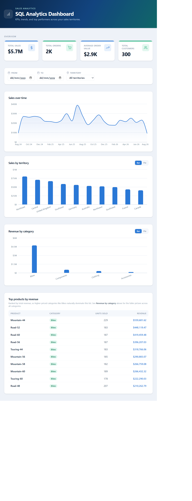
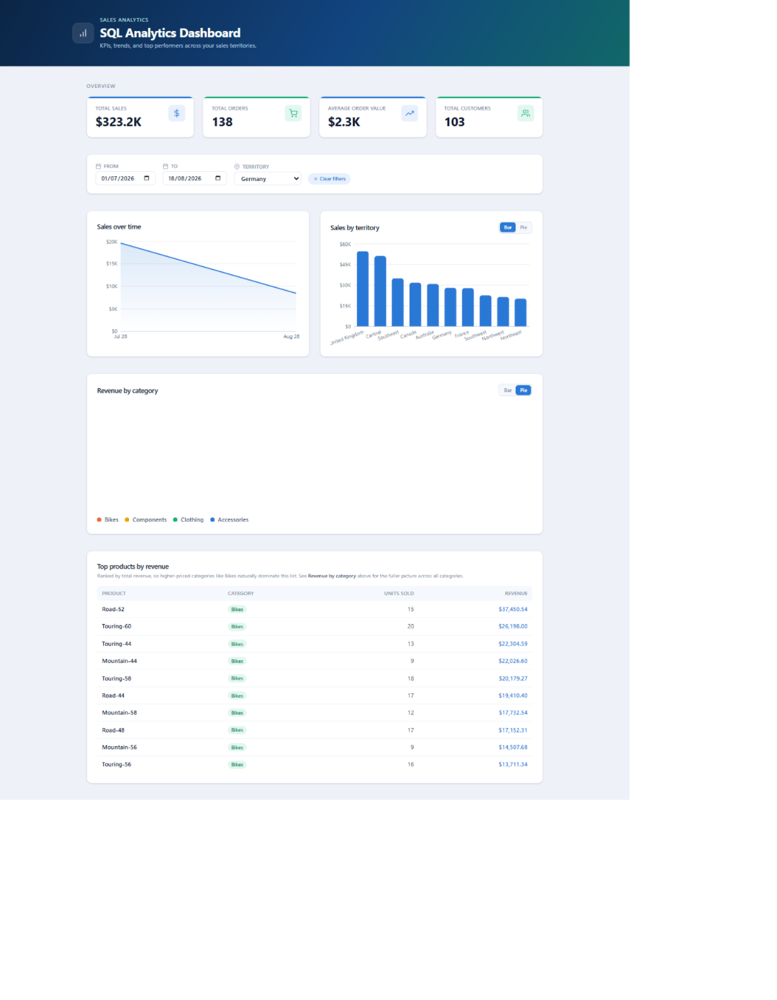
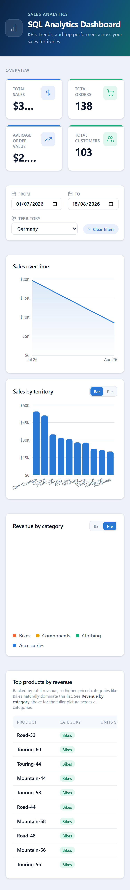

# SQL Analytics Dashboard

A full-stack analytics dashboard that visualizes sales data from a PostgreSQL database — KPIs, sales trends, top products, and territory/category breakdowns, all filterable by date range and region.

**🔗 Live demo:** https://sql-analytics-dashboard.emdej111.workers.dev
**⚙️ Live API:** https://sql-analytics-dashboard-production.up.railway.app/docs

[](https://github.com/emdej111/sql-analytics-dashboard/actions/workflows/backend-tests.yml)
[](https://github.com/emdej111/sql-analytics-dashboard/actions/workflows/frontend-ci.yml)

> Built using AI-assisted development (Claude Code for architecture and implementation) — reflecting a modern development workflow where AI tools accelerate implementation while the developer owns architecture, integration, and product decisions. See [About this repository](#about-this-repository) for more.

## Problem

Business questions like "how's revenue trending this quarter" or "which products are carrying the business" usually have an answer sitting in a relational database — but getting to it means writing SQL, or waiting on whoever can. That doesn't scale as a way for a team to check in on the numbers, and it puts a technical bottleneck in front of a question that should be self-serve.

## Solution

A dashboard that sits directly on top of the database and exposes the common questions as interactive views: current totals, trend over time, top performers, and category/regional breakdowns, all scoped by the same date-range and territory filters. The backend does the aggregation in SQL (via SQLAlchemy, not application-side loops), so the numbers stay fast and correct as the dataset grows; the frontend turns them into charts a non-technical stakeholder can explore without asking anyone for a query.

## Features

- **KPI summary** — total sales, total orders, average order value, and total customers, all filter-aware and shown as the first thing on the page
- **Sales-over-time** area chart, aggregated by month
- **Sales by territory**, with a bar/pie toggle
- **Revenue by category**, surfacing the full product mix (not just the highest-revenue category)
- **Top 10 products by revenue**, with units sold, as a sortable table
- **Date range + territory filtering** that scopes every chart and KPI at once, so the numbers always agree with each other
- **Graceful loading and empty states** — skeletons on first load; a filter change keeps the previous chart visible at reduced opacity instead of flashing back to a blank state; a friendly message when a filter combination has no matching data
- **Responsive layout**, from a single-column phone view up to a multi-column desktop layout
- **Automated backend test suite** (pytest) covering all API endpoints, including edge cases and date-range filtering
- **CI pipeline** (GitHub Actions) that runs the backend test suite and frontend build/lint checks on every push
- **Seed script** that generates a realistic sample dataset (10 sales territories, ~120 products across 4 categories, 300 customers, 2,000 orders with line items) inspired by the shape of Microsoft's [AdventureWorks](https://learn.microsoft.com/en-us/sql/samples/adventureworks-install-configure) sample database — useful for anyone cloning this repo without access to a real production dataset

## Tech stack

| Layer                  | Technology                                                                  |
| ----------------------- | ----------------------------------------------------------------------------- |
| Backend framework       | [FastAPI](https://fastapi.tiangolo.com/)                                    |
| ORM                     | [SQLAlchemy](https://www.sqlalchemy.org/)                                   |
| Database                | [PostgreSQL](https://www.postgresql.org/)                                   |
| Backend language        | Python                                                                       |
| Testing                 | [pytest](https://pytest.org/)                                               |
| CI/CD                   | [GitHub Actions](https://github.com/features/actions)                       |
| Backend hosting         | [Railway](https://railway.app/)                                             |
| Frontend framework      | [React](https://react.dev/) + [TypeScript](https://www.typescriptlang.org/) |
| Build tool              | [Vite](https://vite.dev/)                                                   |
| Charts                  | [Recharts](https://recharts.org/)                                           |
| Styling                 | [Tailwind CSS](https://tailwindcss.com/)                                    |
| Frontend hosting        | [Cloudflare Workers](https://workers.cloudflare.com/)                       |
| Sample data generation  | [Faker](https://faker.readthedocs.io/)                                      |

## Getting started

### 1. Database

Install PostgreSQL locally, then create the database:

```bash
createdb sales_analytics
```

### 2. Backend

```bash
cd backend
python3 -m venv venv
source venv/bin/activate
pip install -r requirements.txt
cp .env.example .env   # adjust DATABASE_URL if needed
python3 seed.py        # creates tables and loads sample data
uvicorn main:app --reload
```

The API is now available at `http://localhost:8000` — try `http://localhost:8000/docs` for the interactive API documentation.

### 3. Frontend

```bash
cd frontend
npm install
cp .env.example .env   # adjust VITE_API_BASE_URL if needed
npm run dev
```

The dashboard is now available at `http://localhost:5173`.

### 4. Running tests

```bash
cd backend
source venv/bin/activate
pytest
```

## Deployment

The backend is deployed on [Railway](https://railway.app/):

1. Create a new Railway project from this repo, add a **PostgreSQL** service, and connect it to the backend service.
2. Railway automatically injects `DATABASE_URL` for the linked Postgres plugin — `database.py` reads it from the environment, so no code changes are needed. (It also normalizes a legacy `postgres://` scheme to `postgresql://`, in case a provider hands that out.)
3. Set an `ALLOWED_ORIGINS` environment variable to a comma-separated list of the frontend origins allowed to call the API, e.g. `http://localhost:5173,https://your-frontend.workers.dev`.
4. Seed the database once, after the first deploy, via Railway's Console or CLI: `python backend/seed.py`. The script is idempotent — it checks for existing orders and skips seeding if the database is already populated.

The frontend is deployed on [Cloudflare Workers](https://workers.cloudflare.com/) as a static site:

```bash
cd frontend
npx wrangler login      # one-time authentication
npm run deploy           # builds and deploys in one step
```

`VITE_API_BASE_URL` is set via `.env.production` and gets baked into the build at deploy time.

## Project structure

```
sql-analytics-dashboard/
├── .github/
│   └── workflows/       CI pipelines for backend tests and frontend build/lint
├── backend/
│   ├── main.py           FastAPI app + /api endpoints
│   ├── models.py          SQLAlchemy models (Order, OrderDetail, Product, Customer, SalesTerritory)
│   ├── schemas.py         Pydantic response models
│   ├── database.py        Engine/session setup
│   ├── seed.py             Generates and loads sample data
│   ├── tests/               pytest test suite
│   └── requirements.txt
├── frontend/
│   ├── wrangler.jsonc      Cloudflare Workers deployment config
│   └── src/
│       ├── api/             Typed API client
│       ├── components/      Dashboard, filters, KPI cards, charts, table
│       ├── lib/              Formatting helpers
│       └── types/            Shared frontend types
└── screenshots/
```

## A note on the data

This project uses **synthetic sample data**, generated by the `seed.py` script using the [Faker](https://faker.readthedocs.io/) library. The schema and data shape are inspired by Microsoft's AdventureWorks sample database, but the actual rows (products, customers, orders) are randomly generated, not sourced from a real AdventureWorks dataset. This keeps the project fully self-contained — anyone can clone the repo and have a working dashboard with realistic-looking data in minutes, without needing access to a licensed or pre-populated database.

One deliberate design note: because Bikes are priced roughly 10–30x higher than other categories, a strict "top products by revenue" ranking is naturally dominated by bikes even though they're a minority of the catalog (18 of 118 products). Rather than hide or "fix" this, the dashboard surfaces it honestly — the Top Products table includes a caption explaining the ranking, and a separate **Revenue by category** chart shows the fuller picture across all four categories.

## Screenshots

**Overview**



**Filtered view**



**Mobile view**



## About this repository

This project was built iteratively with [Claude Code](https://claude.com/claude-code), Anthropic's AI coding agent, as an AI-assisted development workflow: schema design, API implementation, component architecture, chart styling, and deployment configuration were built through conversational, iterative prompts, with direction, review, and final decisions made by the author at each step. It's included here as an example of that workflow, not to claim the code was unsupervised — the author reviewed, tested, and adjusted the output throughout, including diagnosing and fixing environment setup issues (PostgreSQL configuration, CORS, port conflicts), a query ordering bug caught by the test suite, a Recharts v3 animation rendering bug (root-caused via a real client-side React render, not guesswork), and a filesystem-level issue that was corrupting config files during deployment (traced to running the project from a Windows-mounted drive under WSL, resolved by moving the project to the native Linux filesystem).

## Author

**Monika Jurak**

[GitHub](https://github.com/emdej111) · [LinkedIn](https://www.linkedin.com/in/monika-j-265563398)

